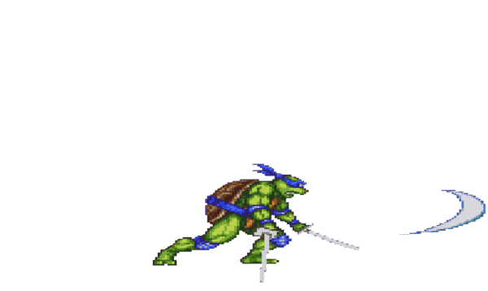

<!-- ### Hi there 👋

### “love the life you live. live the life you love.” :blush:  -->

 
  ###  :vulcan_salute:   <a target="_blank" rel="noopener noreferrer" href="https://tenzin-intro.netlify.app/">  **_tenzin.me_**   </a> "^_^"

<!-- 
 -->
<!--   -->
<!-- 
 -->

<!--  -->

<!-- 
 -->

<!--  -->

<!--  -->

<!--  -->

<!-- width="900px" height="200px"  -->

<!--
 

### hii: 

 
 
-->

<!--
**gyurmey/gyurmey** is a ✨ _special_ ✨ repository because its `README.md` (this file) appears on your GitHub profile.

Here are some ideas to get you started:

- 🔭 I’m currently working on ...
- 🌱 I’m currently learning ...
- 👯 I’m looking to collaborate on ...
- 🤔 I’m looking for help with ...
- 💬 Ask me about ...
- 📫 How to reach me: ...
- 😄 Pronouns: ...
- ⚡ Fun fact: ...
-->
